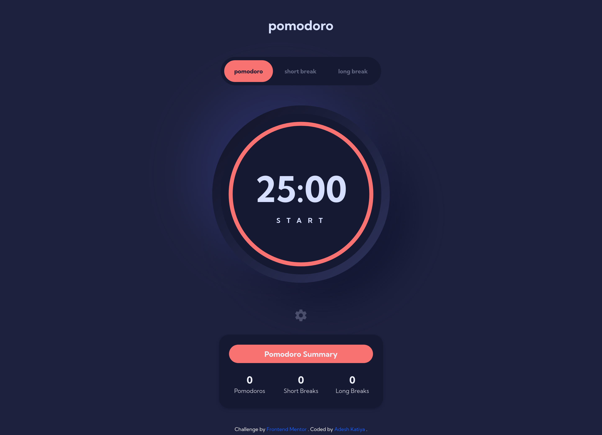

# Frontend Mentor - Pomodoro App solution

This is a solution to the [Pomodoro App challenge on Frontend Mentor](https://www.frontendmentor.io/challenges/pomodoro-app-KBFnycJ6G).

## Table of contents

- [Overview](#overview)
    - [The challenge](#the-challenge)
    - [Screenshot](#screenshot)
    - [Links](#links)
- [My process](#my-process)
    - [Built with](#built-with)
    - [What I learned](#what-i-learned)
    - [Continued development](#continued-development)
    - [Useful resources](#useful-resources)

## Overview

### The challenge

Users should be able to:

- Set a Pomodoro timer and short & long break timers
- Customize how long each timer runs for
- See a circular progress bar that updates every minute and represents how far through their timer they are
- Customize the appearance of the app with the ability to set preferences for colors and fonts

### Screenshot

### Links

- Solution URL: [GitHub repo](https://github.com/adeysh/fem__pomodoro-app)
- Live Site URL: [Vercel Live preview](https://fm-galleria-slideshow-using-astro-sass-tailwind.vercel.app/)

## My process

### Built with

- Semantic HTML5 markup
- CSS custom properties
- Flexbox
- CSS Grid
- Tailwind
- Mobile-first workflow
- Vanilla JS

### What I learned

I tried creating very modular app and styled it accurately using tailwind so kind of got familiar with tailwind styling.

### Continued development

Building the backend for this using a framework.

### Useful resources

[tailwind docs](https://tailwindcss.com/docs) - Helped me with tailwind classes
